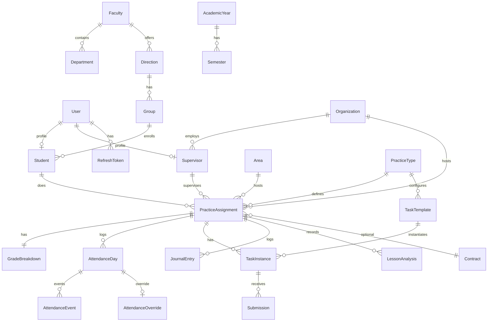

# ARCHITECTURE — Texnik arxitektura va domen modeli

## Tanlangan stack va sabablari

### Backend: FastAPI (DRF emas)
| Mezon | FastAPI | DRF |
|---|---|---|
| Async | ✅ native | ⚠️ qo'shimcha (channels) |
| Type safety | ✅ Pydantic v2 strict | ⚠️ serializerlar |
| OpenAPI | ✅ avtomatik | ⚠️ drf-spectacular |
| Perf | ✅ ~2-3× tez | ⚠️ sync default |
| Learning curve | 🟡 kichik | 🟢 katta ekosistema |
| Admin panel | ❌ yo'q (SPA admin) | ✅ Django admin |

**Qaror**: FastAPI — loyihani bosqichma-bosqich modullashga oson, async WebSocket/geo uchun tabiiy, tipli frontend bilan to'liq integratsiya.

### Frontend: React + Vite (Next.js emas)
- SPA kifoya (authenticated app, SEO kerak emas)
- Vite dev server tez
- Bundle kichik va nazorat ostida
- Server Components kerak emas (hamma authenticated)

### Monorepo: pnpm + Turborepo
- Shared types (OpenAPI → TS)
- Parallel build, caching
- CI tezroq

---

## Domain Model (asosiy entitylar)

### Identity
```
User
  id (uuid)
  username (unique)
  email (unique, nullable)
  phone (nullable)
  password_hash
  role: enum [super_admin, admin, supervisor, student]
  is_active
  last_login_at
  created_at / updated_at

RefreshToken
  id
  user_id → User
  token_hash
  expires_at
  revoked_at
  user_agent, ip

AuditLog
  id
  actor_id → User (nullable for system)
  action (e.g. "contract.approve")
  entity_type, entity_id
  payload (JSONB)
  created_at
```

### Academic
```
Faculty
  id, name, code

Department
  id, faculty_id → Faculty, name, code

Direction  (ta'lim yo'nalishi: "60110100 - Pedagogika")
  id, code (unique), name
  faculty_id → Faculty

Group
  id, direction_id → Direction, name, course (1..4), academic_year

AcademicYear
  id, name ("2025-2026"), start_date, end_date, is_active

Semester
  id, academic_year_id, name ("Kuzgi" | "Bahorgi"), start_date, end_date

Student  (User.role = student uchun profile)
  id, user_id → User (1:1)
  hemis_id (unique)
  first_name, last_name, middle_name
  jshshir (encrypted)
  passport_seria (encrypted)
  group_id → Group
  course, region, district
  enrollment_year, status [studying, graduated, expelled, academic_leave]
  avatar_url
```

### Practice (8 xil turdagi amaliyot konfiguratsiyasi)
```
PracticeType  (seed: 8 ta)
  id, code (unique), name
  requires_contract: bool
  object_kind: enum [organization, area, any]
  min_weeks, max_weeks
  days_per_week (nullable)
  hours_per_day (nullable)
  allowed_courses: int[]  (e.g. [2,3,4] for 4+2)
  grading_rules: JSONB  (mezonlar ro'yxati + ball)
  syllabus_md: TEXT
  contract_template_ref: str (e.g. "4_plus_2" | "pedagogical" | "qualifying")

Example grading_rules:
{
  "min_total": 60,
  "criteria": [
    {"key": "attendance", "name": "Davomat", "max": 10, "grader_role": "system",
     "formula": "step", "thresholds": [[90,10],[70,5],[60,3],[0,0]]},
    {"key": "events", "name": "Tadbirlar ishtiroki", "max": 20, "grader_role": "supervisor"},
    {"key": "tasks", "name": "O'quv topshiriqlar", "max": 60, "grader_role": "supervisor"},
    {"key": "defense", "name": "Hisobot himoyasi", "max": 10, "grader_role": "department_head"}
  ]
}
```

### Placement
```
Organization  (maktab / MTT / korxona)
  id, kind: enum [school, mtt, university, company, lyceum, college]
  name, legal_name, inn, mfo
  bank_account, bank_correspondent
  director_full_name
  address, region, district
  phone, email, website
  geo_point (lat, lng)
  geo_radius_m (default 100)
  wifi_ssids: str[] (optional whitelist)
  work_days: int[] (e.g. [1,2,3,4,5] mon-fri)
  work_hours: {start: "08:00", end: "15:00"}
  capacity (talabalar soni)
  notes

Area  (hudud — shartnomasiz)
  id, name, description
  region, district
  geo_bounds: GeoJSON Polygon (nullable)
  capacity

Supervisor  (User.role = supervisor uchun profile)
  id, user_id → User (1:1)
  first_name, last_name, middle_name
  position (lavozim)
  organization_id → Organization (nullable if external)
  capacity (max talaba soni)
  experience_years
  specialty
  rating (computed)
```

### Assignment
```
PracticeAssignment  (= talabaning biror amaliyotga biriktirilishi)
  id
  student_id → Student
  practice_type_id → PracticeType
  academic_year_id → AcademicYear
  semester_id → Semester (nullable — dala uchun yo'q)
  organization_id → Organization (nullable)
  area_id → Area (nullable)
  supervisor_id → Supervisor (nullable — area uchun)
  university_mentor_id → User (admin/teacher biriktirilgan)
  start_date, end_date
  status: enum [draft, active, completed, cancelled]
  final_grade (nullable, 0..100)
  credit_earned (bool)
  cancelled_reason, cancelled_at
  created_at, updated_at

CONSTRAINT: exactly one of organization_id / area_id is not null
CONSTRAINT: contract required iff practice_type.requires_contract
```

### Contract
```
Contract
  id
  number (unique, avto: "CHDPU-4+2-2026-0001")
  assignment_id → PracticeAssignment (nullable — ko'p talabaga bitta shartnoma ham bo'lishi mumkin)
  practice_type_id
  organization_id → Organization
  students: JSONB [{student_id, full_name, direction_code, course, start, end}, ...]
  status: enum [draft, student_submitted, org_approved, uni_approved, active, expired, revoked]
  template_ref (4_plus_2 | pedagogical | qualifying | internship_prod | ...)
  start_date, end_date
  pdf_path (generated)
  scan_path (supervisor uploaded signed version)
  qr_token (unique, for public verify URL)
  generated_at
  signed_at_org, signed_at_uni
  revoked_reason, revoked_at
  created_by_id → User
```

### Attendance
```
AttendanceDay
  id
  assignment_id → PracticeAssignment
  date
  status: enum [pending, green, red, excused]
  note
  created_by_id (nullable — system)
  UNIQUE(assignment_id, date)

AttendanceEvent
  id
  attendance_day_id → AttendanceDay
  kind: enum [check_in, check_out]
  ts (timestamp)
  lat, lng, accuracy_m
  wifi_ssid (nullable)
  device_id (nullable)
  confirmed_by_supervisor (bool)
  confirmed_at

AttendanceOverride
  id
  attendance_day_id → AttendanceDay (red only)
  override_by_id → User (super_admin)
  from_status, to_status
  reason (majburiy)
  created_at
```

### Assessment
```
TaskTemplate  (sillabus asosida, seeded)
  id
  practice_type_id → PracticeType
  course (nullable — agar barcha kurslar uchun bo'lsa)
  semester_kind: enum [autumn, spring, any]
  key (unique per type)  (e.g. "4+2.course3.autumn.lesson_analysis")
  title
  description_md
  points_max
  deadline_rule (e.g. {"month": "oktabr", "quantity": 6})
  kind: enum [attendance, event, task, daily_journal, lesson_analysis, essay, scenario, open_lesson, trial_lesson, report_defense, ...]
  repeatable (bool) — dars tahlili uchun true
  required_quantity (nullable)

TaskInstance  (assignment uchun)
  id
  assignment_id → PracticeAssignment
  task_template_id → TaskTemplate (nullable — ad-hoc bo'lsa)
  title, description_md
  points_max
  deadline
  status: enum [open, submitted, approved, rejected, graded]
  points_awarded
  graded_by_id → User
  grader_role (supervisor | department_head | ...)
  comment, rejection_reason
  created_at

Submission
  id
  task_instance_id → TaskInstance
  content_md
  files: JSONB [{path, name, size, mime}]
  submitted_at
  version (revision tracking)

JournalEntry  (kundalik)
  id
  assignment_id → PracticeAssignment
  date
  content_md
  files: JSONB
  status: enum [draft, submitted, approved, rejected]
  reviewed_by_id, reviewed_at, review_comment

LessonAnalysis  (dars tahlili)
  id
  assignment_id → PracticeAssignment
  date, subject, teacher_name, grade_level
  analysis_md
  files: JSONB
  status (draft/submitted/approved/rejected)
```

### Grading
```
GradeBreakdown  (bitta per assignment)
  id
  assignment_id → PracticeAssignment (unique)
  criteria_scores: JSONB  ({"attendance": 8, "events": 18, "tasks": 50, "defense": 9})
  total (computed)
  credit_earned (bool)
  finalized_at
  finalized_by_id
```

### Documents / Archive
```
ArchiveJob  (celery task tracking)
  id
  assignment_id → PracticeAssignment
  format: enum [zip, pdf]
  status: enum [queued, running, done, failed]
  output_path
  error
  requested_by_id
  created_at, finished_at
```

### Notifications
```
Notification
  id
  user_id → User
  kind (e.g. "contract.approved", "task.graded")
  title, body, link
  read_at (nullable)
  created_at
```

---

## ERD (Mermaid)



---

## API Konvensiyalari

### URL prefix
`/api/v1/<resource>`

### Pagination
`?page=1&page_size=20` → `{"items": [...], "total": N, "page": 1, "page_size": 20}`

### Filtering & sorting
`?filter[status]=active&sort=-created_at`

### Error format
```json
{
  "detail": "Validation failed",
  "code": "validation_error",
  "field_errors": {"email": "invalid format"}
}
```

### Auth
- Access token: `Authorization: Bearer <jwt>` (15 min TTL)
- Refresh token: HttpOnly cookie `rt=...` (7 kun, rotating)
- CSRF: SameSite=Strict + double-submit token frontend'da

### Versioning
URL path (`v1`). Breaking change → `v2`, eski 6 oy yashaydi.

---

## RBAC Matrix (asosiy)

| Resource | Super Admin | Admin | Supervisor | Student |
|---|---|---|---|---|
| User CRUD | ✅ | own role ≤ admin | ❌ | ❌ |
| System settings | ✅ | ❌ | ❌ | ❌ |
| Red → Green override | ✅ | ❌ | ❌ | ❌ |
| Practice Type config | ✅ | read | ❌ | ❌ |
| HEMIS import | ✅ | ✅ | ❌ | ❌ |
| Organization CRUD | ✅ | ✅ | read (own) | ❌ |
| Assign students | ✅ | ✅ | ❌ | ❌ |
| Contract approve (uni) | ✅ | ✅ | ❌ | ❌ |
| Contract approve (org) | ❌ | ❌ | ✅ | ❌ |
| Attendance confirm | ❌ | ❌ | ✅ | ❌ |
| Task grade | ❌ | dept_head | ✅ | ❌ |
| Own reports | ❌ | read | read | ✅ |

Implementation: **casbin** policies + FastAPI `Depends(check_perm(resource, action))`.

---

## Deployment (Ubuntu VPS)

```
[Internet]
   │
   ▼
[Nginx] ── TLS (Certbot/Let's Encrypt)
   ├── /api/*    → api container (uvicorn, port 8000)
   ├── /ws/*     → api container (websocket upgrade)
   ├── /verify/* → api container (public QR verify)
   └── /*        → web container (nginx:alpine serving static)

[Docker network]
   postgres:16  (volume mount)
   redis:7
   api (fastapi)
   web (nginx static)
   worker (celery)
   beat (celery beat)
```

Backup: `pg_dump` cron har kunlik, 14 kun saqlanadi, `storage/` rsync.

---

## Kelajakdagi o'zgarishlar

1. **MinIO** ni `storage/` o'rniga — S3 API orqali alohida servis
2. **HEMIS REST API** — agar ruxsat olinsa, avto-sync Celery beat
3. **Mikroservis split** — Auth, Practice, Notification alohida servis bo'lishi mumkin
4. **Meilisearch** — Postgres FTS o'rniga
5. **CQRS / Event sourcing** — audit log dan event store ga

---

## Xavfsizlik checklisti

- [ ] JSHSHIR va passport seria AES-256 encrypted at rest
- [ ] Shifrlash kaliti — KMS yoki Docker secret
- [ ] Parollar: bcrypt cost=12
- [ ] Rate limiting: auth 5/min, public verify 30/min
- [ ] CORS whitelist (prod domenlar)
- [ ] HTTPS majburiy, HSTS header
- [ ] Helmet-ekvivalent headerlar (CSP, X-Frame-Options)
- [ ] SQL injection: faqat ORM, raw query'lar audit bilan
- [ ] File upload: MIME whitelist + virus scan (ClamAV optional)
- [ ] Secrets: `.env` git ga tushmaydi; prod'da Docker secrets
- [ ] Logs: PII mask (JSHSHIR, parol, token)
- [ ] Dependency audit: `pip-audit`, `pnpm audit` CI'da
